# My-Reads

An App developed with React to keep track of Books I'm Reading or Interested in and sort them into different shelfs

# Guide to Run the App on your local machine

1. Fork the reposotiry, then use git clone ot download as a zip file, to have the files on your local machine

2. Open a terminal, go to the "My-Reads" folder and run the command "npm install" to download all the dependencies

3. Run the command "npm start" to run the React App.

4. On your Browser go to localhost:3000, after the server runs and enjoy the App!!!

# Features of the App

## 1. **Main Page**

Has 3 different shelfs to hold books based on user's interest [*Reading, Want to read, already*]

And a button to switch screen, opening the search screen, allowing the user to add new books to his/her shelves.
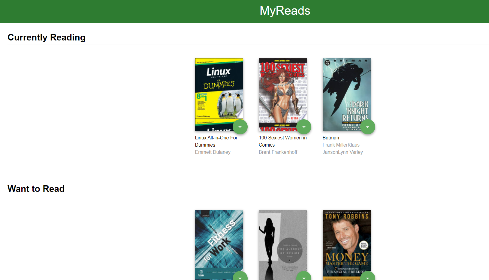
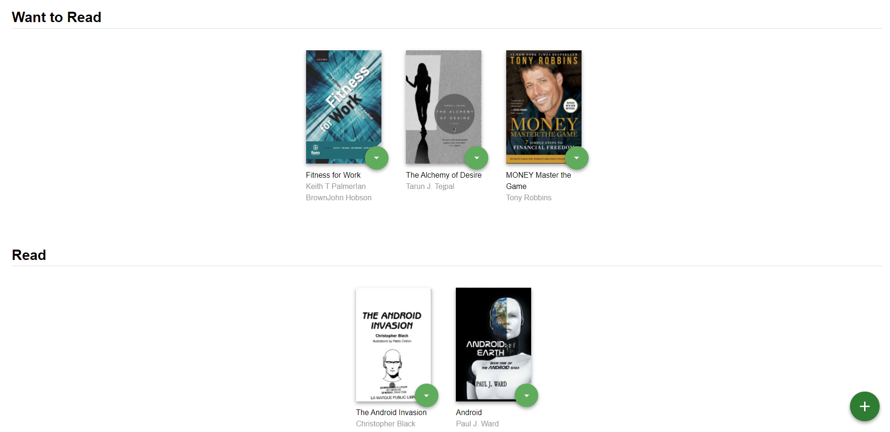

## 2. **Search Page**

Has a search input that takes a query fron the user and returns search results.

The search input is a controlled form, meaning it depends on the state, which makes the UI a function of the state.

The search input gives the user a real time search experience

The search page has a button to go back to the home page as well
The user can add any book to any shelf
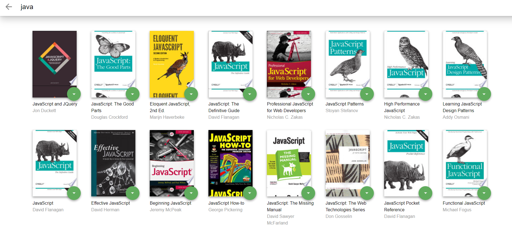
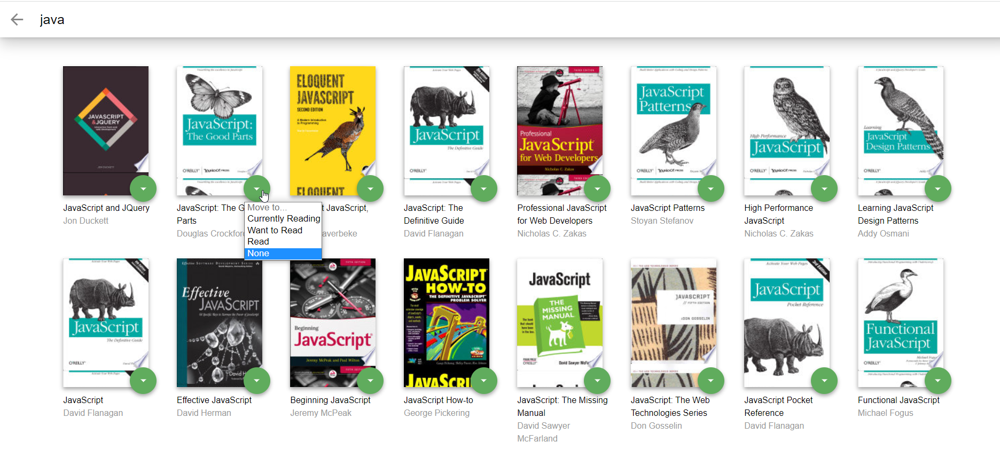

## 3. **Functionality**

The user chooses this book to add to "Want to Read" shelf
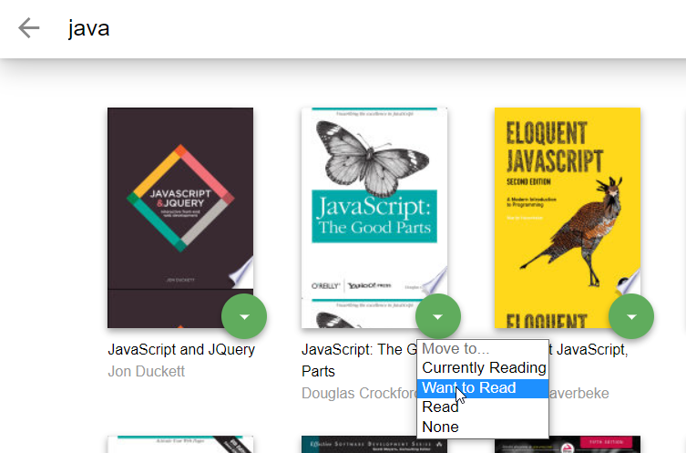
The Book appears on the desired shelf. _Notice the state of book's shelf is updated and preserved_
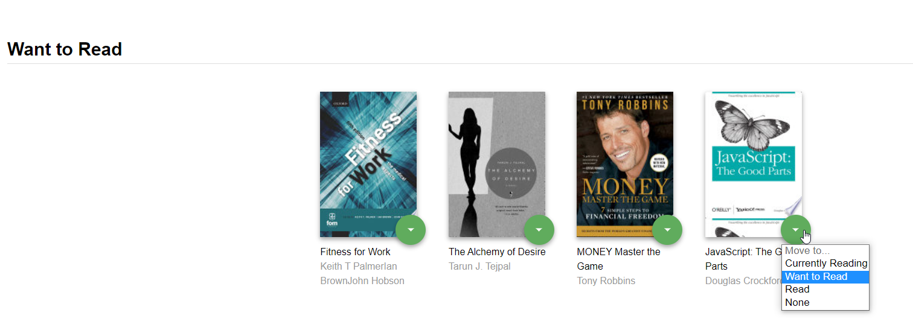
The user moves the book to "Currenlty Reading"
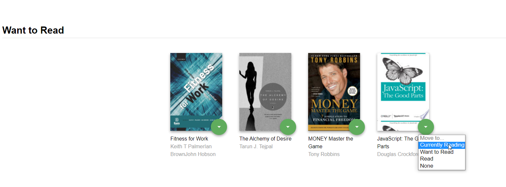
The Book is moved to the desired shelf.
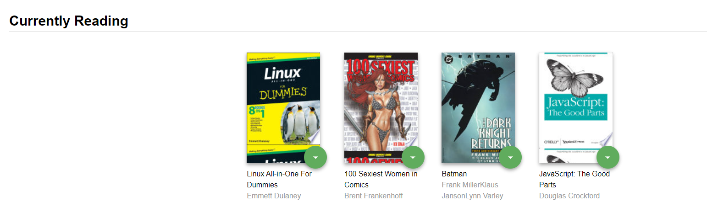
If we check back on the search page, we see that the book's shelf's state is up to date.
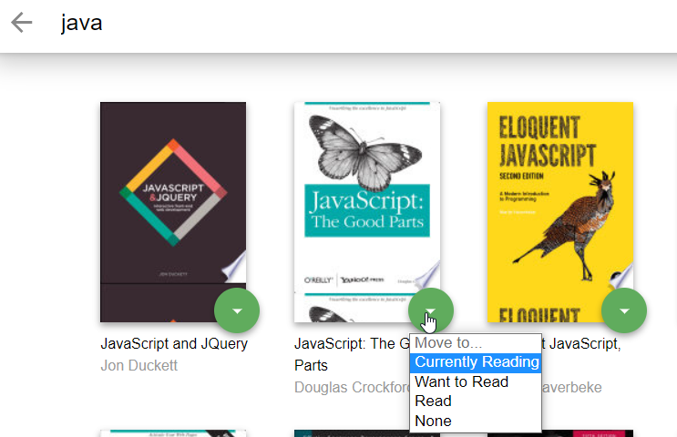
And finally let's look at the "none" option in action.

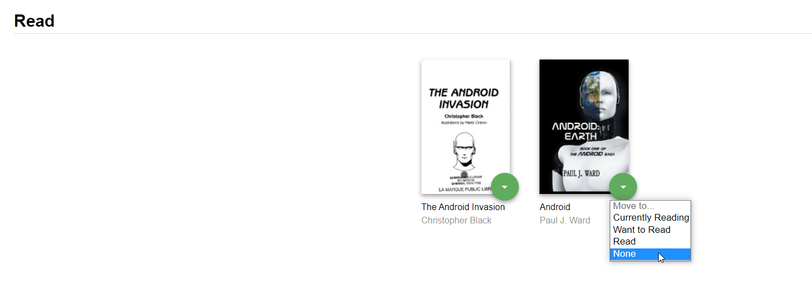
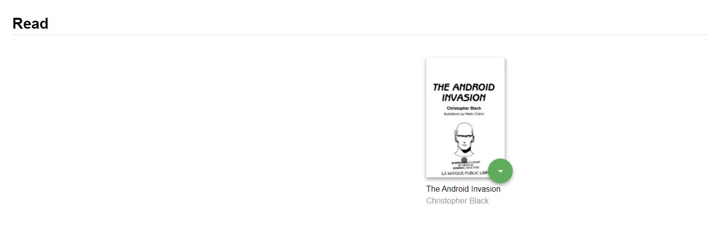
